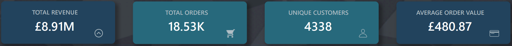
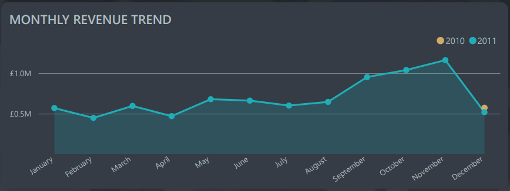
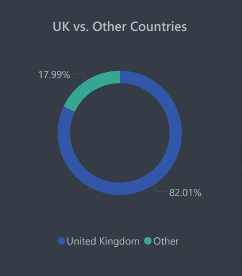
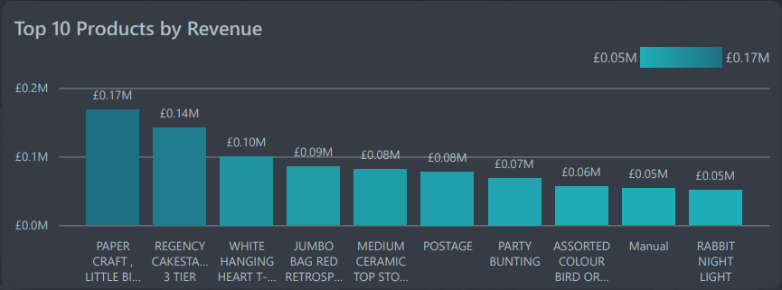
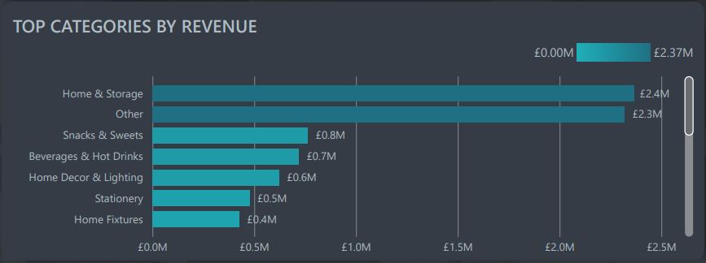
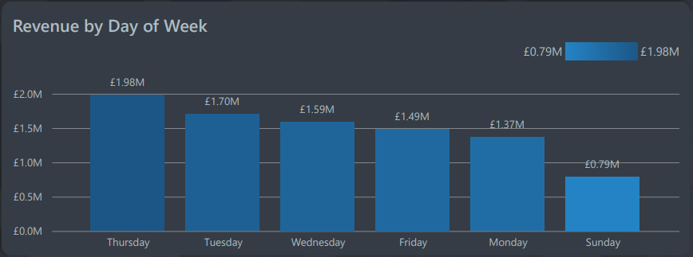
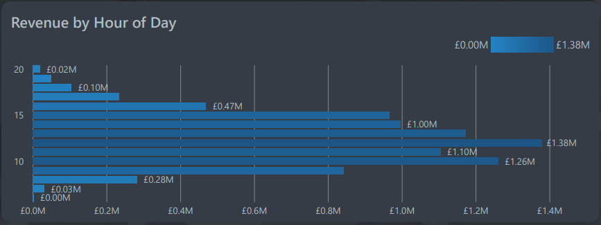

# Online Retail Sales Analysis Dashboard

## Project Overview


This project undertakes a comprehensive data analysis of sales transactions from a UK-based online retail store spanning from December 2010 to December 2011. The analytical pipeline leverages **Python** for robust data manipulation and statistical analysis, transforming raw data into a clean, enriched dataset. Subsequently, **Power BI** is used to develop an interactive, visually engaging dashboard that translates complex data insights into an accessible format for business stakeholders.

The core objective is to uncover critical patterns and actionable intelligence within the sales data, specifically addressing:

-   **Data Transformation & Feature Engineering:** Using Python to clean raw data, handle missing values, create new metrics (e.g., `total_item_price`, `order_year`, `order_month`, `order_hour`, `order_day_of_week`), and prepare the dataset for in-depth analysis.
-   **Key Performance Indicators (KPIs):** Monitoring essential business metrics like total revenue, total orders, and unique product sales.
-   **Temporal Sales Analysis:** Identifying trends and seasonality in sales over months, days of the week, and hours of the day.
-   **Product & Category Performance:** Pinpointing top-selling products and most profitable categories.
-   **Geographical Sales Distribution:** Understanding revenue contributions from various countries, with a detailed focus on the primary UK market versus international sales.

This project demonstrates proficiency in end-to-end data analysis, from raw data processing with Python to professional dashboard creation with Power BI, aiming to provide strategic insights for optimizing inventory, marketing efforts, and operational efficiency.

## Business Questions Addressed

This dashboard aims to answer critical business questions such as:
- What are the overall revenue and order trends over time?
- Which products and product categories contribute most significantly to revenue?
- How is revenue distributed geographically, and which countries are key markets?
- Are there specific days of the week or hours of the day with higher sales activity?
- What are the key performance indicators (KPIs) for the business?

## Data Source

The dataset used for this analysis is a transactional dataset containing all purchases made by customers from a UK-based online retail store between December 1, 2010, and December 9, 2011. It includes details such as invoice number, product description, quantity, unit price, invoice date, customer ID, and country of purchase.

The raw data was initially processed and cleaned using Python, resulting in the `online_retail_cleaned_original_country.csv` file, which serves as the data source for the Power BI dashboard.

## Tools and Technologies

- **Python:** For data cleaning, transformation, feature engineering (e.g., `total_item_price`, `order_year`, `order_month`, `order_hour`, `order_day_of_week`), and initial exploratory data analysis (EDA).
    - Key libraries: Pandas
- **Power BI Desktop:** For data modeling, creating interactive visualizations, and building the final dashboard.
- **GitHub:** For version control and project hosting.

## Project Structure

- `Online_Retail_Analysis_Dashboard.pbix`: The Power BI Desktop file containing the interactive dashboard.
- `online_retail_cleaned.csv`: The cleaned and prepared dataset used in the Power BI dashboard.
- `[Online Retail].ipynb` or `.py`: (Optional but Recommended) The Jupyter Notebook or Python script detailing the data cleaning and preparation steps.
- `README.md`: This file provides an overview of the project.
- `images/`: (Optional) A directory for storing screenshots of the dashboard and key visualizations.

## Key Insights from the Dashboard

(You'll want to personalize these based on what *your* dashboard actually shows. Here are some examples:)

-   **Dominant Market Share:** The United Kingdom accounts for over 80% of the total revenue, highlighting its critical importance to the business.
-   **Consistent Growth:** The monthly revenue trend generally shows an upward trajectory, indicating healthy business growth over the analyzed period.
-   **Top Performers:** Specific products and categories consistently drive the highest revenue, indicating potential for targeted marketing or inventory management.
-   **Peak Activity:** Identifying specific days and hours with the highest sales can inform operational decisions like staffing and promotional timing.

## Dashboard Visualizations

Here's an overview of the interactive dashboard:

### Dashboard Purpose
> *Analyze sales trends, identify top markets & products, and optimize inventory.*

### Key Performance Indicators (KPIs)


-   **Total Revenue:** The grand total of all sales.
-   **Total Orders:** The distinct count of customer orders.
-   **Total Unique Products:** The number of different products sold.

### Monthly Revenue Trend


-   A line chart displaying the sum of `total_item_price` over `order_date` (Year, Month) to visualize sales performance trends.

### Revenue Distribution (UK vs. Other Countries)


-   A donut chart illustrating the percentage contribution of the United Kingdom versus all other countries to the total revenue, using a custom `Country Group` column for clarity.

### Top 10 Products by Revenue


-   A horizontal bar chart showcasing the ten products that generated the highest revenue, allowing for quick identification of best-sellers.

### Top Product Categories by Revenue


-   A bar chart detailing the most lucrative product categories, useful for strategic planning and inventory focus.

### Revenue by Day of Week


-   A column chart showing the total revenue for each day of the week, helping to identify busiest sales days.

### Revenue by Hour of Day


-   A column chart illustrating revenue distribution across the hours of the day, useful for understanding peak operational times.

## How to View and Interact with the Dashboard

1.  **Download Power BI Desktop:** If you don't have it, download the free application from the official Microsoft Power BI website.
2.  **Clone the Repository:**
    ```bash
    git clone https://github.com/[YourUsername]/PowerBI-Online-Retail-Analysis.git
    ```
    (Replace `[YourUsername]` and `PowerBI-Online-Retail-Analysis` with your actual GitHub details).
3.  **Open the `.pbix` file:** Navigate to the cloned directory and open `Online_Retail_Analysis_Dashboard.pbix` with Power BI Desktop.
4.  **Interact:** Once opened, you can use the slicers and click on different visuals to interact with the data and explore insights dynamically.

## Future Enhancements

-   Implement customer segmentation analysis (e.g., RFM).
-   Forecast future sales trends using advanced analytical models.
-   Integrate additional external data sources (e.g., marketing spend, website traffic) for a more holistic view.
-   Create a dynamic "Other" category for top N products/categories based on user selection.

---
